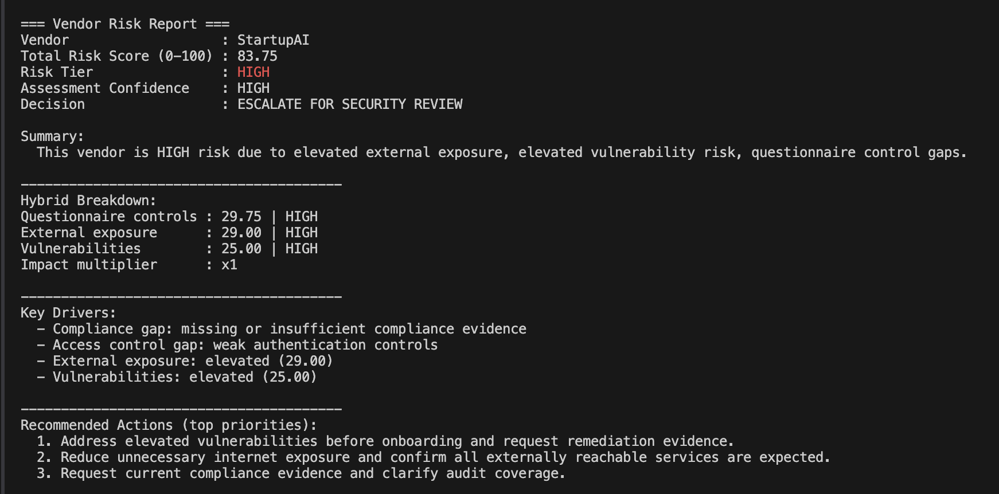
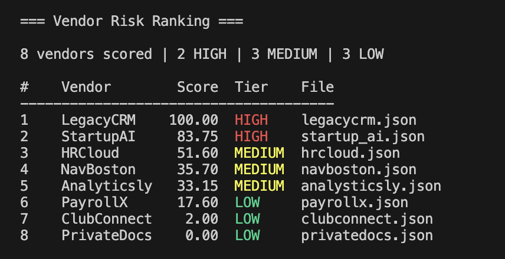

# Vendor Risk Assessment Tool

A Python-based cybersecurity tool that evaluates third-party vendors using questionnaire responses, external exposure signals, vulnerability findings, and business impact factors to generate explainable risk scores.

| Single Vendor Assessment | Multi Vendor Ranking |
|---|---|
|  |  |

## Overview

This project simulates a vendor security review workflow used in cybersecurity risk and third-party risk management.  
The tool combines multiple technical and business risk signals to produce structured vendor risk assessments and comparisons.

## Features

- Evaluates questionnaire responses using weighted security control scoring
- Assesses external exposure signals that expand a vendor's attack surface
- Analyzes vulnerability findings that increase exploitability risk
- Applies business impact multipliers and contextual amplification factors
- Produces explainable reports with key drivers and recommendations
- Compares multiple vendors and ranks them by risk
- Exports single-vendor assessments to markdown reports

## Risk Model

The scoring model reflects how security teams evaluate vendor risk by combining several signals.

### Security Controls

Vendors are evaluated using weighted questionnaire responses across categories such as:

- **Access Control** — authentication strength (MFA, SSO)
- **Data Protection** — encryption and sensitive data handling
- **Compliance** — audit evidence and assurance posture
- **Incident History** — past incidents and response transparency

### External Exposure

Internet-facing services increase a vendor's attack surface and potential entry points.

### Vulnerabilities

Known vulnerabilities increase exploitability and raise the vendor's risk score.

### Business Impact Factors

Risk is amplified when vendors have:

- privileged system access
- operational dependency
- sensitive data exposure
- high business criticality

These factors increase the final score to reflect the potential impact of a compromise.

## CLI Usage

### Run a single vendor assessment

```bash
python -m src.main --vendor data/vendor1.json
```

### Export a markdown report
```bash
python -m src.main --vendor data/vendor1.json --export-md reports/vendor_report.md
```

### Compare multiple vendors
```bash
python -m src.main --folder data/multivendor
```
